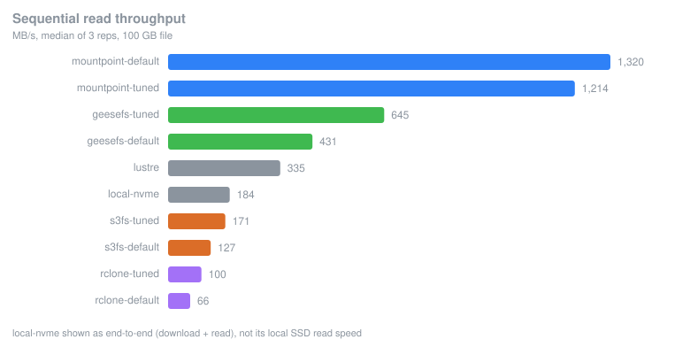
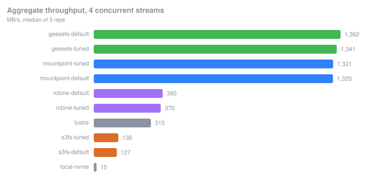
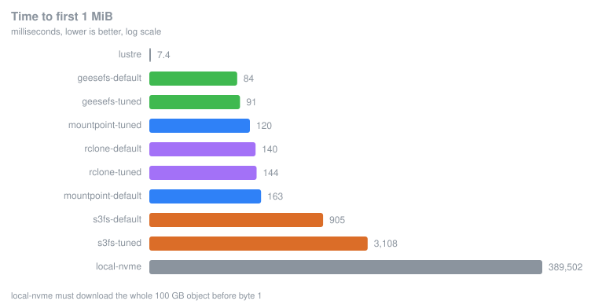
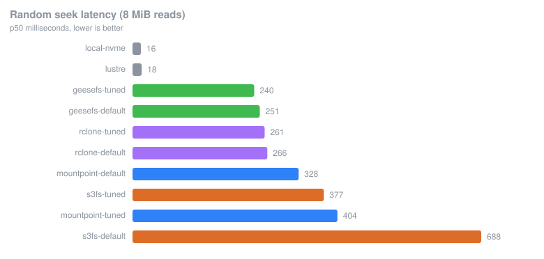

# S3 filesystem benchmarks

Which way of getting large video files out of S3 onto a Kubernetes node is fastest.
Built for 50-200 GB assets (an hour of ProRes 422 HQ runs about 100 GB), not for lots of
small objects. Terraform, EKS, and a harness that runs every candidate on the same node.

## Read this first

Use Mountpoint for Amazon S3 at defaults, plus `--metadata-ttl indefinite`.

It does 1320 MB/s where stock s3fs does 127, so roughly 10x. Don't tune its read path.
My tuned settings came out slower (1214 MB/s). The metadata flag is unrelated to that and
takes `stat` from 62/s to 286,000/s.

Files worth opening:

- `results/prod.md`, the real numbers. 100 GB files, 3 reps, 10 candidates.
- `results/dev.md`, the same thing on 5 GB files. Kept because it is wrong in a useful way:
  at that size everything fits in RAM. See Gotchas.
- `docs/*.svg`, the charts below. Regenerate with `bench/chart.py`.

Two cases where Mountpoint isn't the pick:

- Several workers on one node: GeeseFS. Same aggregate (1362 vs 1320 MB/s) but it shares
  fairly between streams (spread 1.1 vs 2.3). Mountpoint lets one stream starve the others.
- Re-reading the same footage: FSx for Lustre. 7.4 ms to first byte, 18 ms seeks, about 18x
  better than anything else here. The catch is first touch, which lazily imports from S3.
  One cold parallel read took 741 s at 17 MB/s. It also costs $0.23/hr.

Skip s3fs and rclone. rclone manages 66 MB/s and 80 `stat`/s.

## Results

100 GB file, `m5dn.2xlarge`, us-west-2, median of 3 reps.









| client | seq MB/s | TTFB ms | 4-stream MB/s | spread | seek p50 ms | stat/s |
|---|---|---|---|---|---|---|
| mountpoint-default | 1320 | 163 | 1320 | 2.3 | 328 | 62 |
| mountpoint-tuned | 1214 | 120 | 1321 | 1.8 | 404 | 286,161 |
| geesefs-tuned | 645 | 91 | 1341 | 1.1 | 240 | 286,536 |
| geesefs-default | 431 | 84 | 1362 | 1.1 | 251 | 284,155 |
| lustre | 335 | 7.4 | 315 | 1.2 | 18 | 2,900 |
| local-nvme | 184 | 389,502 | n/a | n/a | 17 | n/a |
| s3fs-tuned | 171 | 3108 | 136 | 1.0 | 377 | 39,782 |
| s3fs-default | 127 | 905 | 127 | 1.0 | 688 | 42,629 |
| rclone-tuned | 100 | 144 | 370 | 1.1 | 261 | 80 |
| rclone-default | 66 | 140 | 380 | 1.0 | 266 | 82 |

Check the ceiling before reading the ranking. Best observed on this node was 1415 MB/s
(11.3 Gbit/s), and `bw_in_allowance_exceeded` moves a lot during the fast runs (216,714 on
one). So the top three landing at 1320-1415 MB/s is the instance's network limit, not
theirs. The gaps between them are squashed and shouldn't be read as a ranking. The slow
ones are nowhere near the limit, so those numbers hold up. Separating the top three needs
an instance with sustained bandwidth:

```bash
make up NODE_TYPE=m5dn.8xlarge   # 25 Gbps sustained, needs the 32 vCPU quota
```

## Reproduce

```bash
make data                        # S3 bucket, separate TF state so teardown can't nuke it
make up                          # VPC + EKS + 1 node -> builds and pushes the runner image
make corpus CORPUS_PROFILE=prod  # ~236 GB of synthetic files, generated in-region (~11 min)
make bench  RUN_PROFILE=prod     # the run itself (~3 hr) -> uploads results.jsonl to S3
make report                      # results/*.jsonl -> results/*.md
make down                        # kills the cluster, keeps the bucket
```

`CORPUS_PROFILE=dev` and `RUN_PROFILE=dev` give ~15 GB and ~30 min, which is enough to check
that a change works. `CLIENTS=mountpoint,geesefs` narrows the field. `FSX=1` adds Lustre.

## What it measures

| workload | question |
|---|---|
| `seq_read` | bulk throughput, the headline for hour-long files |
| `ttfb` | ms to first 1 MiB and first 64 MiB, i.e. how soon decoding can start |
| `random_seek` | p50/p95/p99 on 8 MiB reads at random offsets, for scrubbing and keyframes |
| `parallel_read` | aggregate across 4 streams, plus fairness between them |
| `metadata` | `stat` and `listdir` rates |

Every measurement also samples the client process's CPU and RSS and the node's ENA counters.
CPU is worth watching: 1320 MB/s on 3.6 cores and 645 MB/s on 2.2 cores are different trades
on a GPU node.

## Gotchas

All of these actually bit during the build.

- Small test files lie. On 5 GB files the corpus fits in 32 GB of RAM. s3fs "tuning" looked
  like 3.6x there and is 1.3x on 100 GB files. local-nvme looked like 958 MB/s and is really
  184, because you hit NVMe write bandwidth (276 MB/s), not S3. The harness now flags reads
  served from page cache by comparing bytes read against NIC bytes.
- The copy baseline's rate is not an S3 ceiling. I reported it as one and it was wrong.
  276 MB/s is instance-store write speed, and six mount configs beat it, because a mount
  never writes the object to disk at all. The ceiling now comes from the fastest throughput
  actually observed, cross-checked against the ENA allowance counters.
- Don't compare local-nvme's raw read against a mount either. 6.8 GB/s is an SSD read of a
  file that already landed. Its honest number is the end-to-end one.
- GeeseFS is a Yandex fork. It defaults to `storage.yandexcloud.net`, 403s against AWS, and
  falls back to the SigV2 signer. Needs an explicit `--endpoint`.
- s3fs renamed options in 1.97: `parallel_count` became `max_thread_count`, and
  `enable_noobj_cache` became `enable_negative_cache`. Old tuning guides silently do nothing.
- EKS node group updates deadlock under a tight vCPU quota. An in-place update starts the
  replacement before draining the old node, so it wants twice the vCPUs. One 8 vCPU node
  against an 8 vCPU quota fails with `VcpuLimitExceeded`, then `NodeCreationFailure`. The
  node group name hashes its bootstrap config so changes destroy and recreate instead.
- Lustre DRA needs `batch_import_meta_data_on_create = true`. Without it, a corpus written
  before the association exists is invisible under the mount, and Lustre quietly drops out
  of the comparison.
- `kubectl logs -f` will not survive a 3 hr run. It drops with `http2: client connection
  lost`, which used to abort `make bench` and skip collecting results while the Job carried
  on running fine.

## Cost

$0.644/hr while running (node $0.544, EKS control plane $0.100), plus $0.23/hr with Lustre.
The full prod run above cost about $2.60. Same-region S3 to EC2 transfer is free, and the
GETs for a 236 GB corpus come to about a cent.

Idle cost after `make down` is just the corpus sitting in S3, around $5/mo for the prod
profile. `make nuke` deletes that too.

## Method notes

- Page cache is dropped between every repetition and each client's own disk cache is wiped.
  Otherwise rep 2 measures RAM. That's why the pod runs privileged.
- Every client is smoke-tested before any measurement, so a bad flag costs 10 seconds instead
  of turning up an hour later as a suspiciously slow result.
- Host networking, so the real ENA device is visible for the allowance counters and the CNI
  datapath stays out of a storage measurement.
- Medians, not bests. The best run of a usually-slow client isn't what production sees.
- Anything with real knobs is measured twice, default and tuned. "Your mount is slow" is often
  just "your mount is at defaults", which is worth telling apart from a real difference
  between projects.

## Caveats

- One instance type, one region. The ranking among the fast clients is network-bound, as above.
- local-nvme is measured as copy-then-read. A pipelined version, fetching file N+1 while the
  GPU works on N, would hide the copy latency and do much better. The harness doesn't model
  that, and its 4-way concurrent copy is self-inflicted contention a real pipeline wouldn't have.
- local-nvme only finished 1 of 3 reps before teardown, so that row is a single sample.
- goofys is left out on purpose. Last release was April 2020 and GeeseFS supersedes it.
